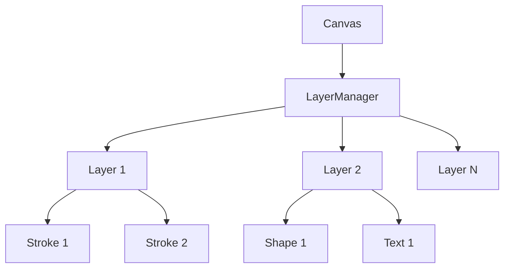
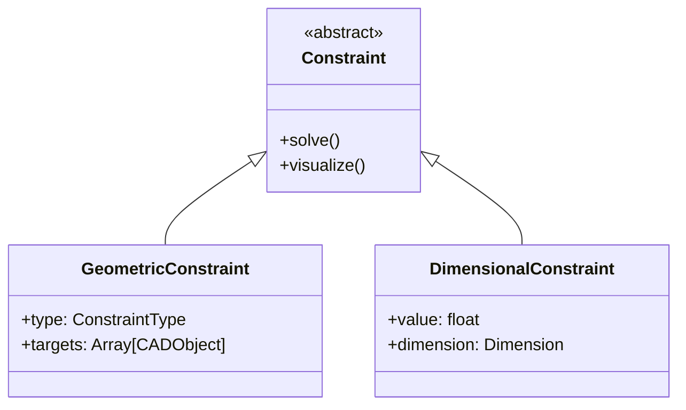

# GOCAD - 无限画板到开源CAD应用转换规划

## 当前应用分析

### 现有功能
- **无限画布**：支持平移和缩放的无限绘图空间
- **绘图工具**：画笔、矩形、圆形、直线、擦除、选择
- **项目管理**：创建、保存、打开项目文件
- **撤销/重做**：完整的操作历史系统
- **UI系统**：工具栏、菜单栏、状态栏、主题支持
- **国际化**：多语言支持（12种语言）
- **画笔自定义**：大小、颜色、压力曲线
- **网格系统**：点状和线状网格模式

### 技术栈
- **引擎**：Godot 4.x
- **语言**：GDScript
- **架构**：模块化设计，清晰的分离关注点
- **数据存储**：自定义项目格式，支持JSON序列化

## 转换目标

将当前的无限画板应用转换为功能完整的开源CAD应用，保持现有的优秀特性，同时添加CAD特定功能。

## 转换路线图

### 阶段1：核心CAD功能（基础版本）

#### 1.1 添加CAD特定工具
- [ ] **精确直线工具**：支持角度约束（0°, 15°, 30°, 45°, 60°, 75°, 90°）
- [ ] **矩形工具增强**：添加精确尺寸输入（宽度×高度）
- [ ] **圆形工具增强**：添加精确半径/直径输入
- [ ] **弧线工具**：支持起始角度、结束角度和半径
- [ ] **多边形工具**：支持正多边形（3-12边）
- [ ] **文本工具**：支持多行文本和字体自定义

#### 1.2 层管理系统
- [ ] **图层面板**：可视化图层列表
- [ ] **图层操作**：创建、删除、重命名、重新排序
- [ ] **图层属性**：可见性、锁定、不透明度
- [ ] **图层选择**：当前活动图层选择
- [ ] **图层导出**：按图层导出功能

#### 1.3 精确测量和对齐
- [ ] **智能捕捉**：端点、中点、中心、交点捕捉
- [ ] **对齐线**：显示对齐辅助线
- [ ] **尺寸标注**：线性、角度、半径尺寸标注
- [ ] **测量工具**：距离、角度、面积测量

#### 1.4 对象属性编辑器
- [ ] **属性面板**：显示选中对象的属性
- [ ] **几何属性**：位置、尺寸、旋转
- [ ] **视觉属性**：颜色、线宽、填充
- [ ] **文本属性**：字体、大小、对齐

### 阶段2：高级CAD功能

#### 2.1 约束系统
- [ ] **几何约束**：水平、垂直、平行、垂直、相切
- [ ] **尺寸约束**：固定距离、固定角度
- [ ] **约束求解器**：自动满足约束条件
- [ ] **约束可视化**：显示约束图标和状态

#### 2.2 块和符号库
- [ ] **块系统**：可重用的对象组
- [ ] **块管理器**：创建、编辑、插入块
- [ ] **符号库**：预定义的CAD符号
- [ ] **动态块**：参数化块支持

#### 2.3 高级选择和编辑
- [ ] **选择过滤器**：按类型、图层、颜色选择
- [ ] **编辑工具**：修剪、延伸、偏移、镜像、阵列
- [ ] **布尔操作**：合并、减去、交集（用于复杂形状）

### 阶段3：文件格式和互操作性

#### 3.1 导入/导出格式
- [ ] **DXF导入/导出**：AutoCAD标准格式
- [ ] **SVG增强**：改进的SVG导出，支持CAD特性
- [ ] **PDF导出**：带尺寸标注的PDF输出
- [ ] **图像导出**：PNG、JPEG、WebP（高分辨率）

#### 3.2 项目文件格式
- [ ] **版本化格式**：支持向后兼容性
- [ ] **压缩选项**：可选的项目压缩
- [ ] **元数据支持**：作者、创建日期、修改日期

### 阶段4：UI/UX改进

#### 4.1 CAD特定UI
- [ ] **工具栏重组**：CAD工具优先
- [ ] **状态栏增强**：显示当前坐标、捕捉状态
- [ ] **命令行**：类似AutoCAD的命令输入
- [ ] **快捷键自定义**：可自定义的快捷键映射

#### 4.2 主题和可访问性
- [ ] **CAD主题**：高对比度、工程蓝图风格
- [ ] **夜间模式**：适合长时间工作
- [ ] **可访问性**：键盘导航、屏幕阅读器支持

## 技术实现细节

### 架构变更

#### 1. 图层系统实现


#### 2. 对象模型扩展
```gdscript
# 扩展当前的BrushStroke系统
class_name CADObject extends Node2D
    var layer_id: int
    var properties: Dictionary
    var constraints: Array[Constraint]
    var is_locked: bool
    var is_visible: bool
```

#### 3. 约束系统设计


### 关键技术挑战

1. **性能优化**：
   - 大型项目的渲染性能
   - 复杂约束的求解性能
   - 图层管理的内存使用

2. **精度问题**：
   - 浮点精度在大尺寸项目中
   - 约束求解的数值稳定性
   - 单位转换和一致性

3. **用户体验**：
   - 直观的约束创建和编辑
   - 有效的错误反馈
   - 发现性和可学习性

## 实施时间表

### 里程碑1：核心CAD功能（4-6周）
- 精确绘图工具
- 基本图层系统
- 智能捕捉和对齐
- 对象属性编辑器

### 里程碑2：高级功能（6-8周）
- 约束系统
- 块和符号库
- 高级选择和编辑工具

### 里程碑3：文件格式（3-4周）
- DXF导入/导出
- 增强的SVG/PDF支持
- 项目文件格式改进

### 里程碑4：UI/UX改进（3-4周）
- CAD特定UI元素
- 命令行接口
- 主题和可访问性

## 兼容性考虑

### 向后兼容性
- 保持对现有项目文件的支持
- 逐步迁移到新的数据模型
- 提供项目升级工具

### 平台支持
- 确保所有功能在Windows、macOS、Linux上工作
- 触摸屏支持（平板电脑）
- 高DPI显示支持

## 测试策略

### 自动化测试
- 单元测试：核心算法和约束求解器
- 集成测试：工具之间的交互
- 性能测试：大型项目的性能

### 手动测试
- 用户工作流测试
- 兼容性测试
- 可访问性测试

### 测试用例
1. 创建带约束的复杂几何图形
2. 多图层项目的导入/导出
3. 大型项目（1000+对象）的性能
4. 不同单位和精度设置

## 文档要求

### 用户文档
- 快速入门指南
- 工具参考
- 高级教程（约束、块等）
- 疑难解答指南

### 开发者文档
- 架构概述
- API参考
- 贡献指南
- 构建和部署指南

## 社区参与

### 开源准备
- 许可证选择（MIT或GPL）
- 贡献者协议
- 问题模板
- 拉取请求流程

### 社区构建
- 论坛或Discord服务器
- 定期开发更新
- 社区反馈机制
- 翻译贡献

## 成功标准

### 最低可行产品（MVP）
- 所有核心CAD工具可用
- 基本图层系统
- 智能捕捉和对齐
- DXF导入/导出
- 稳定性和性能可接受

### 完整版本
- 所有计划功能已实施
- 完整的文档
- 积极的社区参与
- 定期更新和维护

## 风险评估

### 技术风险
1. **约束求解器复杂性**：可能需要迭代开发
2. **DXF兼容性**：不同CAD软件的DXF方言
3. **性能问题**：大型项目的渲染

### 缓解策略
1. 逐步实施约束系统
2. 使用成熟的DXF库或逐步实施
3. 早期性能测试和优化

## 结论

这个转换计划提供了一个全面的路线图，将现有的无限画板应用转换为功能完整的开源CAD应用。通过分阶段实施，我们可以确保每个组件都被正确集成和测试，同时保持应用的稳定性和可用性。

关键成功因素包括：
- 保持现有的优秀用户体验
- 逐步添加CAD特定功能
- 确保性能和稳定性
- 构建积极的开源社区

这个计划为创建一个强大的、用户友好的开源CAD解决方案奠定了基础，可以与专有解决方案竞争，同时提供开放和可扩展的平台供未来发展。