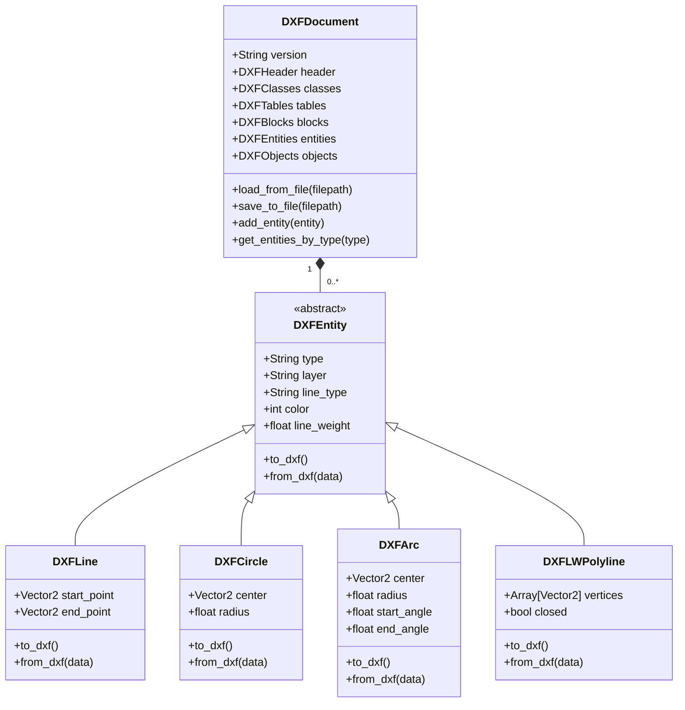

# DXF集成计划 - GOCAD

## 概述

这个文档详细说明了将DXF（Drawing Exchange Format）作为GOCAD的默认文件格式的集成计划。这个集成是将应用程序从无限画板转换为完整CAD应用程序的关键步骤。

## 目标

1. **将DXF作为默认格式**：所有新文件默认保存为DXF格式
2. **完整的DXF支持**：导入和导出DXF文件（R12-R2013格式）
3. **CAD对象转换**：将当前的笔画和形状转换为DXF实体
4. **图层和线型支持**：实施完整的DXF图层和线型系统
5. **性能优化**：确保大型DXF文件的快速加载和保存

## 当前状态分析

### 当前文件系统

- **自定义格式**：当前使用自定义项目格式
- **笔画为主**：所有绘图存储为笔画对象
- **有限的元数据**：基本的项目元数据
- **无图层支持**：所有内容在单一“画布”上

### 需要更改的内容

1. **文件格式**：从自定义格式迁移到DXF
2. **对象模型**：从笔画到DXF实体（线、圆、弧等）
3. **图层系统**：实施完整的DXF图层支持
4. **线型**：添加对连续线、虚线、点线等的支持
5. **颜色系统**：从RGB迁移到DXF颜色索引

## DXF集成路线图

### 阶段1：研究和规划

#### 1.1 DXF格式研究
- [x] 研究DXF规范（R12-R2013）
- [x] 确定所需的实体类型
- [x] 研究现有的DXF库和工具
- [x] 创建DXF功能矩阵

#### 1.2 设计DXF数据模型
- [ ] 创建DXF实体类层次结构
- [ ] 设计图层和线型系统
- [ ] 规划颜色和样式映射
- [ ] 设计DXF文档结构

### 阶段2：核心DXF支持

#### 2.1 DXF基础架构


#### 2.2 实施DXF导出器

```gdscript
# DXFExporter.gd
class_name DXFExporter

var current_version: String = "AC1015"  # R2000格式

func export_to_dxf(document: DXFDocument, filepath: String) -> bool:
    var file = File.new()
    if file.open(filepath, File.WRITE) != OK:
        return false
    
    # 写入头部
    _write_header(file, document)
    
    # 写入表
    _write_tables(file, document)
    
    # 写入块
    _write_blocks(file, document)
    
    # 写入实体
    _write_entities(file, document)
    
    # 写入对象
    _write_objects(file, document)
    
    # 结束文件
    file.store_string("0\nEOF\n")
    file.close()
    return true

func _write_header(file: File, document: DXFDocument):
    file.store_string("0\nSECTION\n2\nHEADER\n")
    
    # 标准头变量
    file.store_string("9\n$ACADVER\n1\n%s\n" % current_version)
    file.store_string("9\n$INSBASE\n10\n0.0\n20\n0.0\n30\n0.0\n")
    file.store_string("9\n$EXTMIN\n10\n-1000.0\n20\n-1000.0\n30\n0.0\n")
    file.store_string("9\n$EXTMAX\n10\n1000.0\n20\n1000.0\n30\n0.0\n")
    
    file.store_string("0\nENDSEC\n")

func _write_tables(file: File, document: DXFDocument):
    file.store_string("0\nSECTION\n2\nTABLES\n")
    
    # 线型表
    _write_linetype_table(file)
    
    # 图层表
    _write_layer_table(file, document)
    
    # 样式表
    _write_style_table(file)
    
    # 视口表
    _write_view_table(file)
    
    file.store_string("0\nENDSEC\n")

func _write_linetype_table(file: File):
    file.store_string("0\nTABLE\n2\nLTYPE\n70\n1\n")
    
    # 连续线型
    file.store_string("0\nLTYPE\n2\nCONTINUOUS\n70\n64\n3\nSolid line\n72\n65\n73\n0\n0\nENDTAB\n")
    
    # 虚线线型
    file.store_string("0\nLTYPE\n2\nDASHED\n70\n64\n3\nDashed __ __ __\n72\n65\n73\n2\n40\n0.5\n49\n0.25\n49\n-0.1\n0\nENDTAB\n")

func _write_layer_table(file: File, document: DXFDocument):
    file.store_string("0\nTABLE\n2\nLAYER\n70\n%d\n" % document.tables.layers.size())
    
    for layer in document.tables.layers:
        file.store_string("0\nLAYER\n2\n%s\n70\n64\n62\n7\n6\nCONTINUOUS\n" % layer.name)
        if layer.color != 256:  # 256 = BYLAYER
            file.store_string("62\n%d\n" % layer.color)
        file.store_string("0\nENDTAB\n")

func _write_entities(file: File, document: DXFDocument):
    file.store_string("0\nSECTION\n2\nENTITIES\n")
    
    for entity in document.entities:
        file.store_string(entity.to_dxf())
    
    file.store_string("0\nENDSEC\n")
```

#### 2.3 实施DXF导入器

```gdscript
# DXFImporter.gd
class_name DXFImporter

var current_line: int = 0
var lines: Array = []
var current_section: String = ""
var current_entity: DXFEntity = null

func import_from_dxf(filepath: String) -> DXFDocument:
    var file = File.new()
    if file.open(filepath, File.READ) != OK:
        return null
    
    var document = DXFDocument.new()
    lines = file.get_as_text().split("\n")
    file.close()
    
    current_line = 0
    
    while current_line < lines.size():
        var code = lines[current_line]
        current_line += 1
        
        if current_line >= lines.size():
            break
        
        var value = lines[current_line]
        current_line += 1
        
        _process_code_pair(code, value, document)
    
    return document

func _process_code_pair(code: String, value: String, document: DXFDocument):
    match code:
        "0":  # 实体类型
            match value:
                "SECTION":
                    current_section = _read_section_type()
                "ENDSEC":
                    current_section = ""
                "EOF":
                    # 文件结束
                    pass
                "LINE":
                    current_entity = DXFLine.new()
                    current_entity.type = "LINE"
                "CIRCLE":
                    current_entity = DXFCircle.new()
                    current_entity.type = "CIRCLE"
                "ARC":
                    current_entity = DXFArc.new()
                    current_entity.type = "ARC"
                "LWPOLYLINE":
                    current_entity = DXFLWPolyline.new()
                    current_entity.type = "LWPOLYLINE"
                "ENDTAB":
                    # 表结束
                    pass
                _:
                    # 其他实体类型
                    pass
        "8":  # 图层
            if current_entity:
                current_entity.layer = value
        "6":  # 线型
            if current_entity:
                current_entity.line_type = value
        "62":  # 颜色
            if current_entity:
                current_entity.color = int(value)
        "48":  # 线宽
            if current_entity:
                current_entity.line_weight = float(value)
        _:
            if current_entity:
                current_entity.process_code(int(code), value)
            elif current_section == "HEADER":
                _process_header_variable(int(code), value, document)
            elif current_section == "TABLES":
                _process_table_entry(int(code), value, document)

func _read_section_type() -> String:
    # 读取部分类型（在下一行）
    if current_line < lines.size():
        return lines[current_line]
    return ""

func _process_header_variable(code: int, value: String, document: DXFDocument):
    match code:
        9:  # 变量名
            var var_name = value
            if current_line < lines.size():
                var var_code = int(lines[current_line])
                current_line += 1
                if current_line < lines.size():
                    var var_value = lines[current_line]
                    current_line += 1
                    _set_header_variable(var_name, var_code, var_value, document)

func _set_header_variable(name: String, code: int, value: String, document: DXFDocument):
    match name:
        "$ACADVER":
            document.header.version = value
        "$INSBASE":
            if code == 10:
                document.header.insbase_x = float(value)
            elif code == 20:
                document.header.insbase_y = float(value)
            elif code == 30:
                document.header.insbase_z = float(value)
        # 其他头变量...
```

### 阶段3：与当前系统集成

#### 3.1 文件操作迁移

```gdscript
# 修改ProjectManager.gd
func save_project(project: Project, filepath: String = "") -> bool:
    if filepath.empty():
        filepath = project.filepath
    
    # 确定要使用的格式
    var use_dxf = true  # 默认为DXF
    
    if filepath.get_extension().to_lower() == ".dxf":
        use_dxf = true
    elif filepath.get_extension().to_lower() == ".gocad":  # 旧格式
        use_dxf = false
    
    if use_dxf:
        return _save_as_dxf(project, filepath)
    else:
        return _save_as_legacy(project, filepath)

func _save_as_dxf(project: Project, filepath: String) -> bool:
    # 将项目转换为DXF文档
    var dxf_doc = DXFDocument.new()
    
    # 设置头部信息
    dxf_doc.header.version = "AC1015"  # R2000
    
    # 创建图层
    var layer = DXFLayer.new()
    layer.name = "0"
    layer.color = 7  # 白色
    dxf_doc.tables.add_layer(layer)
    
    # 将笔画转换为DXF实体
    for stroke in project.strokes:
        var dxf_entity = _convert_stroke_to_dxf_entity(stroke)
        if dxf_entity:
            dxf_doc.entities.append(dxf_entity)
    
    # 导出为DXF
    var exporter = DXFExporter.new()
    return exporter.export_to_dxf(dxf_doc, filepath)

func _convert_stroke_to_dxf_entity(stroke: BrushStroke) -> DXFEntity:
    # 分析笔画以确定最佳DXF实体类型
    var points = stroke.points
    
    if points.size() == 2:
        # 直线
        var line = DXFLine.new()
        line.layer = "0"
        line.line_type = "CONTINUOUS"
        line.color = 7  # 白色
        line.line_weight = stroke.size * 0.1  # 转换笔画大小为线宽
        line.start_point = points[0]
        line.end_point = points[1]
        return line
    
    elif points.size() > 2:
        # 多段线
        var polyline = DXFLWPolyline.new()
        polyline.layer = "0"
        polyline.line_type = "CONTINUOUS"
        polyline.color = 7  # 白色
        polyline.line_weight = stroke.size * 0.1
        polyline.closed = false
        
        for point in points:
            polyline.vertices.append(point)
        
        return polyline
    
    return null

func _save_as_legacy(project: Project, filepath: String) -> bool:
    # 旧的保存逻辑用于向后兼容性
    # ...现有的保存代码...
    return true

func load_project(filepath: String) -> Project:
    var project = Project.new()
    
    if filepath.get_extension().to_lower() == ".dxf":
        return _load_from_dxf(filepath)
    else:
        return _load_from_legacy(filepath)

func _load_from_dxf(filepath: String) -> Project:
    var importer = DXFImporter.new()
    var dxf_doc = importer.import_from_dxf(filepath)
    
    if not dxf_doc:
        return null
    
    var project = Project.new()
    project.filepath = filepath
    
    # 将DXF实体转换为笔画
    for entity in dxf_doc.entities:
        var stroke = _convert_dxf_entity_to_stroke(entity)
        if stroke:
            project.strokes.append(stroke)
    
    return project

func _convert_dxf_entity_to_stroke(entity: DXFEntity) -> BrushStroke:
    var stroke = BrushStroke.new()
    
    # 设置笔画属性
    stroke.color = _dxf_color_to_godot(entity.color)
    stroke.size = entity.line_weight * 10  # 转换线宽为笔画大小
    
    match entity.type:
        "LINE":
            var line = entity as DXFLine
            stroke.add_point(line.start_point)
            stroke.add_point(line.end_point)
        
        "LWPOLYLINE":
            var polyline = entity as DXFLWPolyline
            for vertex in polyline.vertices:
                stroke.add_point(vertex)
        
        "CIRCLE":
            # 将圆近似为多段线
            var circle = entity as DXFCircle
            var segments = 32
            for i in range(segments + 1):
                var angle = i * 2 * PI / segments
                var point = circle.center + Vector2(cos(angle), sin(angle)) * circle.radius
                stroke.add_point(point)
        
        # 其他实体类型...
    
    return stroke

func _dxf_color_to_godot(dxf_color: int) -> Color:
    # 转换DXF颜色索引为Godot颜色
    match dxf_color:
        1: return Color.RED
        2: return Color.YELLOW
        3: return Color.GREEN
        4: return Color.CYAN
        5: return Color.BLUE
        6: return Color.MAGENTA
        7: return Color.WHITE
        _: return Color.WHITE  # 默认
```

#### 3.2 UI更新

```gdscript
# 修改Main.gd - 更新文件对话框
func _on_save_project():
    var active_project: Project = ProjectManager.get_active_project()
    
    if active_project.filepath.is_empty():
        _file_dialog.file_mode = FileDialog.FILE_MODE_SAVE_FILE
        _file_dialog.filters = ["*.dxf ; DXF Files", "*.gocad ; GOCAD Files"]
        _file_dialog.current_file = "drawing.dxf"  # 默认DXF扩展名
        _file_dialog.file_selected.connect(_on_file_selected_to_save_project)
        _file_dialog.popup_centered()
    else:
        ProjectManager.save_project(active_project)

func _on_open_project():
    _file_dialog.file_mode = FileDialog.FILE_MODE_OPEN_FILE
    _file_dialog.filters = ["*.dxf ; DXF Files", "*.gocad ; GOCAD Files", "*.* ; All Files"]
    _file_dialog.file_selected.connect(_on_file_selected_to_open_project)
    _file_dialog.popup_centered()
```

### 阶段4：高级DXF功能

#### 4.1 图层支持

```gdscript
# 扩展DXF文档以支持图层
func _write_layer_table(file: File, document: DXFDocument):
    file.store_string("0\nTABLE\n2\nLAYER\n70\n%d\n" % document.tables.layers.size())
    
    # 总是首先创建层0
    file.store_string("0\nLAYER\n2\n0\n70\n0\n62\n7\n6\nCONTINUOUS\n0\nENDTAB\n")
    
    # 创建其他图层
    for layer in document.tables.layers:
        if layer.name != "0":  # 跳过层0（已经创建）
            file.store_string("0\nLAYER\n2\n%s\n70\n64\n62\n%d\n6\n%s\n" % [
                layer.name, 
                layer.color, 
                layer.line_type
            ])
            file.store_string("0\nENDTAB\n")

# 图层管理集成
func _convert_stroke_to_dxf_entity(stroke: BrushStroke, layer_mapping: Dictionary) -> DXFEntity:
    # 获取图层信息
    var layer_name = layer_mapping.get(stroke.layer_id, "0")
    
    # 创建实体
    var entity = _create_dxf_entity_from_stroke(stroke)
    entity.layer = layer_name
    
    return entity
```

#### 4.2 线型支持

```gdscript
# 扩展DXF导出器以支持线型
func _write_linetype_table(file: File):
    file.store_string("0\nTABLE\n2\nLTYPE\n70\n%d\n" % 3)  # 3种线型
    
    # 连续线型
    file.store_string("0\nLTYPE\n2\nCONTINUOUS\n70\n64\n3\nSolid line\n72\n65\n73\n0\n0\nENDTAB\n")
    
    # 虚线线型
    file.store_string("0\nLTYPE\n2\nDASHED\n70\n64\n3\nDashed __ __ __\n72\n65\n73\n2\n40\n0.5\n49\n0.25\n49\n-0.1\n0\nENDTAB\n")
    
    # 点线型
    file.store_string("0\nLTYPE\n2\nDOTTED\n70\n64\n3\nDotted . . .\n72\n65\n73\n2\n40\n0.0\n49\n0.0\n49\n-0.1\n0\nENDTAB\n")

# 线型映射
var line_type_mapping = {
    "solid": "CONTINUOUS",
    "dashed": "DASHED",
    "dotted": "DOTTED"
}
```

### 阶段5：性能优化

#### 5.1 大型DXF文件处理

```gdscript
# 优化DXF导入以处理大型文件
func import_from_dxf(filepath: String) -> DXFDocument:
    var file = File.new()
    if file.open(filepath, File.READ) != OK:
        return null
    
    # 使用流式处理以减少内存使用
    var document = DXFDocument.new()
    var buffer = ""
    
    while not file.eof_reached():
        buffer += file.get_line()
        
        # 处理缓冲区
        if buffer.ends_with("\n"):
            _process_buffer(buffer, document)
            buffer = ""
    
    # 处理剩余的缓冲区
    if not buffer.empty():
        _process_buffer(buffer, document)
    
    file.close()
    return document

func _process_buffer(buffer: String, document: DXFDocument):
    var lines = buffer.split("\n")
    var i = 0
    
    while i < lines.size():
        var code = lines[i]
        i += 1
        
        if i >= lines.size():
            break
        
        var value = lines[i]
        i += 1
        
        _process_code_pair(code, value, document)
```

#### 5.2 批量导出优化

```gdscript
# 优化DXF导出以减少内存使用
func _write_entities(file: File, document: DXFDocument):
    file.store_string("0\nSECTION\n2\nENTITIES\n")
    
    # 按类型分组实体以优化写入
    var entities_by_type = {}
    
    for entity in document.entities:
        if not entities_by_type.has(entity.type):
            entities_by_type[entity.type] = []
        entities_by_type[entity.type].append(entity)
    
    # 批量写入每种类型
    for type in entities_by_type:
        var type_entities = entities_by_type[type]
        
        # 使用字符串构建器以减少文件操作
        var builder = StringBuilder.new()
        
        for entity in type_entities:
            builder.append(entity.to_dxf())
        
        file.store_string(builder.as_string())
    
    file.store_string("0\nENDSEC\n")
```

## 实施计划

### 里程碑1：核心DXF支持（2-3周）

1. **DXF基础架构**
   - [ ] 实施DXF文档类
   - [ ] 创建DXF实体基类
   - [ ] 实施基本实体（线、圆、弧、多段线）
   - [ ] 创建DXF头和表结构

2. **基本导出功能**
   - [ ] 实施DXF导出器
   - [ ] 支持基本实体
   - [ ] 添加基本图层支持
   - [ ] 实施颜色映射

3. **基本导入功能**
   - [ ] 实施DXF导入器
   - [ ] 支持基本实体
   - [ ] 处理图层信息
   - [ ] 实施错误处理

### 里程碑2：与当前系统集成（1-2周）

1. **文件操作迁移**
   - [ ] 修改ProjectManager以支持DXF
   - [ ] 实施格式检测
   - [ ] 添加向后兼容性
   - [ ] 更新文件对话框

2. **对象转换**
   - [ ] 将笔画转换为DXF实体
   - [ ] 将DXF实体转换为笔画
   - [ ] 处理属性映射
   - [ ] 实施颜色转换

3. **UI更新**
   - [ ] 更新保存/打开对话框
   - [ ] 添加格式选择
   - [ ] 更新状态栏
   - [ ] 添加DXF特定设置

### 里程碑3：高级DXF功能（2-3周）

1. **完整的图层支持**
   - [ ] 实施DXF图层表
   - [ ] 添加图层管理
   - [ ] 实施图层属性
   - [ ] 更新UI以显示图层

2. **线型支持**
   - [ ] 实施DXF线型表
   - [ ] 添加线型管理
   - [ ] 实施线型渲染
   - [ ] 更新工具以支持线型

3. **块支持**
   - [ ] 实施DXF块表
   - [ ] 添加块管理
   - [ ] 实施块插入
   - [ ] 更新UI以显示块

### 里程碑4：性能和优化（1-2周）

1. **大型文件处理**
   - [ ] 实施流式DXF导入
   - [ ] 优化内存使用
   - [ ] 添加进度指示
   - [ ] 实施文件分割

2. **导出优化**
   - [ ] 实施批量写入
   - [ ] 添加压缩选项
   - [ ] 优化实体排序
   - [ ] 实施缓存

3. **错误处理**
   - [ ] 添加验证
   - [ ] 实施恢复机制
   - [ ] 创建错误日志
   - [ ] 添加用户反馈

### 里程碑5：测试和文档（1周）

1. **测试**
   - [ ] 创建DXF测试套件
   - [ ] 测试导入/导出
   - [ ] 测试兼容性
   - [ ] 测试性能

2. **文档**
   - [ ] 创建用户指南
   - [ ] 创建开发者文档
   - [ ] 添加API参考
   - [ ] 创建示例

3. **发布准备**
   - [ ] 更新README
   - [ ] 添加DXF示例文件
   - [ ] 创建迁移指南
   - [ ] 更新截屏

## 技术挑战

### 1. 格式兼容性

**挑战**：不同CAD应用程序的DXF方言

**解决方案**：
- 专注于最广泛支持的DXF功能（R12-R2000）
- 实施严格的验证
- 提供兼容性模式
- 文档化限制

### 2. 对象转换

**挑战**：将自由形式的笔画转换为精确的CAD实体

**解决方案**：
- 实施智能检测（直线、圆、弧）
- 提供用户反馈
- 添加手动修正选项
- 文档化转换限制

### 3. 性能

**挑战**：处理大型DXF文件

**解决方案**：
- 实施流式处理
- 添加进度指示
- 优化内存使用
- 实施背景处理

### 4. 向后兼容性

**挑战**：保持对旧项目文件的支持

**解决方案**：
- 实施格式检测
- 维护旧的加载/保存代码
- 提供迁移工具
- 文档化兼容性

## 成功标准

### 最低可行产品（MVP）

1. **核心DXF支持**
   - 导入和导出基本DXF文件
   - 支持线、圆、弧、多段线
   - 基本图层支持
   - 与当前系统集成

2. **用户体验**
   - 直观的文件操作
   - 明确的格式选择
   - 有用的错误消息
   - 合理的性能

### 完整实施

1. **高级功能**
   - 完整的图层和线型支持
   - 块支持
   - 优化的性能
   - 完整的兼容性

2. **文档**
   - 完整的用户指南
   - 开发者文档
   - API参考
   - 示例和教程

## 兼容性矩阵

| 功能 | R12 | R13 | R14 | R2000 | R2004 | R2007 | R2010 | R2013 |
|------|-----|-----|-----|-------|-------|-------|-------|-------|
| 线 | ✓ | ✓ | ✓ | ✓ | ✓ | ✓ | ✓ | ✓ |
| 圆 | ✓ | ✓ | ✓ | ✓ | ✓ | ✓ | ✓ | ✓ |
| 弧 | ✓ | ✓ | ✓ | ✓ | ✓ | ✓ | ✓ | ✓ |
| 多段线 | ✓ | ✓ | ✓ | ✓ | ✓ | ✓ | ✓ | ✓ |
| 图层 | ✓ | ✓ | ✓ | ✓ | ✓ | ✓ | ✓ | ✓ |
| 线型 | ✓ | ✓ | ✓ | ✓ | ✓ | ✓ | ✓ | ✓ |
| 块 | ✓ | ✓ | ✓ | ✓ | ✓ | ✓ | ✓ | ✓ |
| 文本 | ✓ | ✓ | ✓ | ✓ | ✓ | ✓ | ✓ | ✓ |
| 尺寸标注 | - | ✓ | ✓ | ✓ | ✓ | ✓ | ✓ | ✓ |
| 样条曲线 | - | - | ✓ | ✓ | ✓ | ✓ | ✓ | ✓ |

## 文件结构

```
docs/
├── dxf_integration_plan.md  # 这个文档
├── dxf_specification_notes.md  # DXF规范笔记
└── dxf_examples/  # 示例DXF文件

gocad/
├── dxf/  # 新的DXF模块
│   ├── DXFDocument.gd  # DXF文档类
│   ├── entities/  # DXF实体
│   │   ├── DXFEntity.gd  # 基类
│   │   ├── DXFLine.gd
│   │   ├── DXFCircle.gd
│   │   ├── DXFArc.gd
│   │   ├── DXFLWPolyline.gd
│   │   └── ...
│   ├── tables/  # DXF表
│   │   ├── DXFTable.gd
│   │   ├── DXFLayerTable.gd
│   │   ├── DXFLineTypeTable.gd
│   │   └── ...
│   ├── DXFExporter.gd  # DXF导出器
│   ├── DXFImporter.gd  # DXF导入器
│   └── utils/  # 实用程序
│       ├── DXFColorMapper.gd
│       ├── DXFLineTypeMapper.gd
│       └── ...
└── ...  # 现有文件
```

## 依赖关系

### 内部依赖关系

- **ProjectManager**：需要修改以支持DXF
- **InfiniteCanvas**：需要更新以处理DXF对象
- **工具系统**：需要更新以创建DXF实体
- **UI系统**：需要更新以反映DXF功能

### 外部依赖关系

- **Godot Engine**：核心引擎功能
- **文件系统**：文件I/O操作
- **DXF规范**：格式参考

## 测试策略

### 单元测试

1. **DXF文档结构**
   - 测试头部创建
   - 测试表管理
   - 测试实体添加/删除
   - 测试验证

2. **DXF导出**
   - 测试基本实体导出
   - 测试图层导出
   - 测试线型导出
   - 测试文件结构

3. **DXF导入**
   - 测试基本实体导入
   - 测试图层导入
   - 测试线型导入
   - 测试错误处理

### 集成测试

1. **文件操作**
   - 测试保存/加载循环
   - 测试格式检测
   - 测试向后兼容性
   - 测试大型文件

2. **对象转换**
   - 测试笔画到DXF
   - 测试DXF到笔画
   - 测试属性映射
   - 测试颜色转换

### 用户测试

1. **工作流**
   - 测试新建/保存为DXF
   - 测试打开DXF文件
   - 测试导出选项
   - 测试兼容性

2. **性能**
   - 测试大型文件
   - 测试复杂图形
   - 测试内存使用
   - 测试响应能力

## 文档要求

### 用户文档

1. **DXF支持指南**
   - 如何使用DXF文件
   - 格式选项
   - 兼容性注意事项
   - 疑难解答

2. **迁移指南**
   - 从旧格式迁移
   - 兼容性设置
   - 常见问题
   - 最佳实践

### 开发者文档

1. **DXF模块API**
   - 类参考
   - 方法和属性
   - 示例代码
   - 集成指南

2. **扩展指南**
   - 添加新的实体类型
   - 扩展导入/导出
   - 自定义映射
   - 性能优化

## 结论

这个DXF集成计划提供了一个全面的路线图，将DXF支持添加到GOCAD。通过分阶段实施，我们可以确保每个组件都被正确集成和测试，同时保持应用程序的稳定性和可用性。

关键成功因素包括：

1. **兼容性**：确保与其他CAD应用程序的广泛兼容性
2. **性能**：优化大型文件的处理
3. **用户体验**：提供直观的界面和明确的反馈
4. **向后兼容性**：保持对现有项目的支持

这个计划为创建一个强大的、兼容的CAD文件格式支持奠定了基础，这是任何专业CAD应用程序的关键组件。