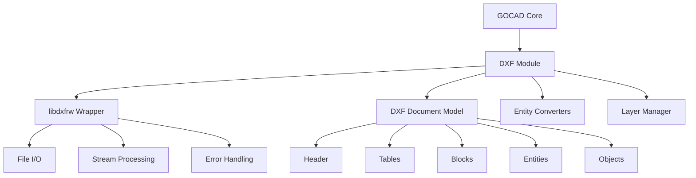
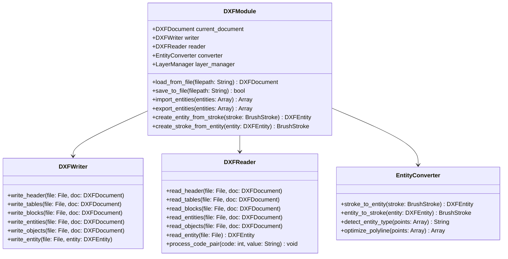

# DXF集成计划 - GOCAD（更新版）

## 概述

这个更新后的文档详细说明了将DXF（Drawing Exchange Format）作为GOCAD的默认文件格式的集成计划，参考了LibreCAD的libdxfrw库和具体实现细节。

## 参考资料

1. **LibreCAD libdxfrw库**：https://github.com/LibreCAD/libdxfrw
2. **LibreCAD DXF实现**：https://github.com/LibreCAD/LibreCAD_3/blob/master/persistence/libdxfrw/dxfimpl.cpp
3. **DXF规范**：Autodesk DXF参考（R12-R2013）

## 目标

1. **将DXF作为默认格式**：所有新文件默认保存为DXF格式
2. **完整的DXF支持**：导入和导出DXF文件（R12-R2013格式）
3. **CAD对象转换**：将当前的笔画和形状转换为DXF实体
4. **图层和线型支持**：实施完整的DXF图层和线型系统
5. **性能优化**：确保大型DXF文件的快速加载和保存

## 架构决策

基于libdxfrw库的经验，我们将采用以下架构：

### 1. 模块化设计



### 2. 核心组件



## 实施细节（参考libdxfrw）

### 1. DXF文档结构

基于libdxfrw的实现，我们将采用以下文档结构：

```gdscript
# DXFDocument.gd
class_name DXFDocument

var version: String = "AC1015"  # R2000 - 最兼容的版本
var header: DXFHeader = DXFHeader.new()
var tables: DXFTables = DXFTables.new()
var blocks: DXFBlocks = DXFBlocks.new()
var entities: Array = []
var objects: Array = []

# 头部变量（来自libdxfrw）
var header_vars: Dictionary = {
    "$ACADVER": "AC1015",
    "$INSBASE": Vector3.ZERO,
    "$EXTMIN": Vector3(-1000, -1000, 0),
    "$EXTMAX": Vector3(1000, 1000, 0),
    "$LTSCALE": 1.0,
    "$LWDISPLAY": 1,
    "$CELTYPE": "BYLAYER",
    "$CECOLOR": 256,  # BYLAYER
    "$CELTSCALE": 1.0
}

func add_entity(entity: DXFEntity):
    entities.append(entity)

func get_entities_by_type(type: String):
    var result = []
    for entity in entities:
        if entity.type == type:
            result.append(entity)
    return result

func validate() -> bool:
    # 实施类似libdxfrw的验证
    if entities.size() == 0:
        return false
    
    # 检查所有实体是否有效
    for entity in entities:
        if not entity.validate():
            return false
    
    return true
```

### 2. DXF实体系统（参考libdxfrw）

```gdscript
# DXFEntity.gd - 基类
class_name DXFEntity extends Resource

enum EntityType {
    LINE,
    CIRCLE,
    ARC,
    LWPOLYLINE,
    POLYLINE,
    TEXT,
    DIMENSION,
    INSERT,
    SPLINE
}

var type: EntityType
var layer: String = "0"
var line_type: String = "BYLAYER"
var color: int = 256  # BYLAYER
var line_weight: int = -1  # BYLAYER
var handle: String = ""

# 来自libdxfrw的常见DXF代码
var dxf_codes: Dictionary = {}

func to_dxf() -> String:
    var result = ""
    
    # 实体类型
    result += "0\n%s\n" % _get_entity_type_name()
    
    # 图层
    result += "8\n%s\n" % layer
    
    # 线型
    if line_type != "BYLAYER":
        result += "6\n%s\n" % line_type
    
    # 颜色
    if color != 256:  # 256 = BYLAYER
        result += "62\n%d\n" % color
    
    # 线宽
    if line_weight != -1:  # -1 = BYLAYER
        result += "370\n%d\n" % line_weight
    
    # 实体特定数据
    result += _get_entity_specific_dxf()
    
    return result

func from_dxf(codes: Dictionary) -> void:
    # 解析DXF代码
    if codes.has(8):
        layer = codes[8]
    if codes.has(6):
        line_type = codes[6]
    if codes.has(62):
        color = int(codes[62])
    if codes.has(370):
        line_weight = int(codes[370])
    
    # 实体特定解析
    _parse_entity_specific_codes(codes)

func validate() -> bool:
    # 基本验证
    if layer.empty():
        return false
    
    # 实体特定验证
    return _validate_entity_specific()

func _get_entity_type_name() -> String:
    match type:
        EntityType.LINE: return "LINE"
        EntityType.CIRCLE: return "CIRCLE"
        EntityType.ARC: return "ARC"
        EntityType.LWPOLYLINE: return "LWPOLYLINE"
        # 其他类型...
    return "UNKNOWN"

func _get_entity_specific_dxf() -> String:
    return ""  # 由子类实现

func _parse_entity_specific_codes(codes: Dictionary):
    pass  # 由子类实现

func _validate_entity_specific() -> bool:
    return true  # 由子类实现
```

### 3. 具体实体实现（参考libdxfrw）

```gdscript
# DXFLine.gd
class_name DXFLine extends DXFEntity

var start_point: Vector3 = Vector3.ZERO
var end_point: Vector3 = Vector3.RIGHT
var extrusion: Vector3 = Vector3.UP  # 挤出方向

func _init():
    type = EntityType.LINE

func _get_entity_specific_dxf() -> String:
    var result = ""
    
    # 起点
    result += "10\n%%.6f\n" % start_point.x
    result += "20\n%%.6f\n" % start_point.y
    result += "30\n%%.6f\n" % start_point.z
    
    # 终点
    result += "11\n%%.6f\n" % end_point.x
    result += "21\n%%.6f\n" % end_point.y
    result += "31\n%%.6f\n" % end_point.z
    
    # 挤出方向（可选）
    if extrusion != Vector3.UP:
        result += "210\n%%.6f\n" % extrusion.x
        result += "220\n%%.6f\n" % extrusion.y
        result += "230\n%%.6f\n" % extrusion.z
    
    return result

func _parse_entity_specific_codes(codes: Dictionary):
    if codes.has(10): start_point.x = float(codes[10])
    if codes.has(20): start_point.y = float(codes[20])
    if codes.has(30): start_point.z = float(codes[30])
    if codes.has(11): end_point.x = float(codes[11])
    if codes.has(21): end_point.y = float(codes[21])
    if codes.has(31): end_point.z = float(codes[31])
    if codes.has(210): extrusion.x = float(codes[210])
    if codes.has(220): extrusion.y = float(codes[220])
    if codes.has(230): extrusion.z = float(codes[230])

func _validate_entity_specific() -> bool:
    # 检查起点和终点是否不同
    if start_point == end_point:
        return false
    
    # 检查坐标是否有效
    if is_nan(start_point.x) or is_nan(start_point.y) or is_nan(start_point.z):
        return false
    if is_nan(end_point.x) or is_nan(end_point.y) or is_nan(end_point.z):
        return false
    
    return true

func get_length() -> float:
    return start_point.distance_to(end_point)

func get_angle() -> float:
    return atan2(end_point.y - start_point.y, end_point.x - start_point.x)
```

### 4. DXF读取器（参考dxfimpl.cpp）

```gdscript
# DXFReader.gd
class_name DXFReader

var current_line: int = 0
var lines: Array = []
var current_section: String = ""
var current_entity: DXFEntity = null
var current_handle: String = ""

# 来自libdxfrw的代码组
var code_groups: Dictionary = {
    0: "STRING",
    1: "STRING",
    2: "NAME",
    3: "STRING",
    4: "STRING",
    5: "HANDLE",
    6: "LINETYPE",
    7: "STRING",
    8: "LAYER",
    9: "VARIABLE",
    10: "X_COORD",
    11: "X_COORD",
    12: "X_COORD",
    13: "X_COORD",
    14: "X_COORD",
    20: "Y_COORD",
    21: "Y_COORD",
    22: "Y_COORD",
    23: "Y_COORD",
    24: "Y_COORD",
    30: "Z_COORD",
    31: "Z_COORD",
    32: "Z_COORD",
    33: "Z_COORD",
    34: "Z_COORD",
    38: "ELEVATION",
    39: "THICKNESS",
    40: "FLOAT",
    41: "FLOAT",
    42: "FLOAT",
    43: "FLOAT",
    44: "FLOAT",
    45: "FLOAT",
    46: "FLOAT",
    47: "FLOAT",
    48: "FLOAT",
    49: "FLOAT",
    50: "ANGLE",
    51: "ANGLE",
    60: "INT",
    62: "COLOR",
    66: "FLAGS",
    70: "FLAGS",
    71: "FLAGS",
    72: "FLAGS",
    73: "FLAGS",
    74: "FLAGS",
    75: "FLAGS",
    90: "INT",
    91: "INT",
    92: "INT",
    93: "INT",
    94: "INT",
    95: "INT",
    96: "INT",
    97: "INT",
    98: "INT",
    99: "INT",
    100: "STRING",
    102: "STRING",
    105: "HANDLE",
    110: "X_COORD",
    111: "X_COORD",
    112: "X_COORD",
    120: "Y_COORD",
    121: "Y_COORD",
    122: "Y_COORD",
    130: "Z_COORD",
    131: "Z_COORD",
    132: "Z_COORD",
    140: "FLOAT",
    141: "FLOAT",
    142: "FLOAT",
    143: "FLOAT",
    144: "FLOAT",
    145: "FLOAT",
    146: "FLOAT",
    147: "FLOAT",
    170: "FLAGS",
    171: "FLAGS",
    172: "FLAGS",
    173: "FLAGS",
    174: "FLAGS",
    175: "FLAGS",
    210: "X_EXTRUSION",
    220: "Y_EXTRUSION",
    230: "Z_EXTRUSION",
    270: "FLAGS",
    271: "FLAGS",
    272: "FLAGS",
    273: "FLAGS",
    280: "FLAGS",
    281: "FLAGS",
    290: "FLAG",
    291: "FLAG",
    292: "FLAG",
    293: "FLAG",
    294: "FLAG",
    295: "FLAG",
    296: "FLAG",
    297: "FLAG",
    298: "FLAG",
    299: "FLAG",
    300: "STRING",
    301: "STRING",
    302: "STRING",
    303: "STRING",
    304: "STRING",
    305: "STRING",
    310: "STRING",
    311: "STRING",
    312: "STRING",
    313: "STRING",
    314: "STRING",
    315: "STRING",
    320: "HANDLE",
    330: "HANDLE",
    340: "HANDLE",
    350: "HANDLE",
    360: "HANDLE",
    370: "LINEWEIGHT",
    380: "HANDLE",
    390: "HANDLE",
    400: "INT",
    401: "INT",
    402: "INT",
    410: "STRING",
    411: "STRING",
    420: "FLOAT",
    430: "STRING",
    440: "FLOAT",
    450: "FLOAT",
    451: "FLOAT",
    452: "FLOAT",
    453: "FLOAT",
    460: "FLOAT",
    461: "FLOAT",
    462: "FLOAT",
    463: "FLOAT",
    470: "STRING",
    480: "HANDLE",
    481: "HANDLE",
    999: "COMMENT",
    1000: "STRING",
    1001: "STRING",
    1002: "STRING",
    1003: "STRING",
    1004: "STRING",
    1005: "HANDLE",
    1010: "FLOAT",
    1011: "FLOAT",
    1012: "FLOAT",
    1013: "FLOAT",
    1020: "FLOAT",
    1021: "FLOAT",
    1022: "FLOAT",
    1023: "FLOAT",
    1030: "FLOAT",
    1031: "FLOAT",
    1032: "FLOAT",
    1033: "FLOAT",
    1040: "FLOAT",
    1041: "FLOAT",
    1042: "FLOAT",
    1050: "HANDLE",
    1051: "HANDLE",
    1052: "HANDLE",
    1053: "HANDLE",
    1054: "HANDLE",
    1055: "HANDLE",
    1056: "HANDLE",
    1057: "HANDLE",
    1058: "HANDLE",
    1059: "HANDLE",
    1060: "HANDLE",
    1061: "HANDLE",
    1062: "HANDLE",
    1063: "HANDLE",
    1070: "INT",
    1071: "INT"
}

func import_from_dxf(filepath: String) -> DXFDocument:
    var file = File.new()
    if file.open(filepath, File.READ) != OK:
        push_error("无法打开文件：%s" % filepath)
        return null
    
    var document = DXFDocument.new()
    lines = file.get_as_text().split("\n")
    file.close()
    
    current_line = 0
    
    # 解析文件
    while current_line < lines.size():
        var code = lines[current_line].strip_edges()
        current_line += 1
        
        if current_line >= lines.size():
            break
        
        var value = lines[current_line].strip_edges()
        current_line += 1
        
        _process_code_pair(int(code), value, document)
    
    return document

func _process_code_pair(code: int, value: String, document: DXFDocument):
    # 处理代码组（参考libdxfrw）
    match code:
        0:  # 实体类型
            _process_code_0(value, document)
        2:  # 名称/变量
            _process_code_2(value, document)
        5:  # 句柄
            current_handle = value
        8:  # 图层
            if current_entity:
                current_entity.layer = value
        6:  # 线型
            if current_entity:
                current_entity.line_type = value
        62:  # 颜色
            if current_entity:
                current_entity.color = int(value)
        370:  # 线宽
            if current_entity:
                current_entity.line_weight = int(value)
        9:  # 变量名
            _process_code_9(value, document)
        10, 20, 30:  # X, Y, Z坐标
            _process_coordinate_codes(code, value)
        _:
            if current_entity:
                current_entity.process_code(code, value)

func _process_code_0(value: String, document: DXFDocument):
    match value:
        "SECTION":
            current_section = _read_section_type()
        "ENDSEC":
            current_section = ""
        "EOF":
            # 文件结束
            pass
        "LINE":
            current_entity = DXFLine.new()
            current_entity.handle = current_handle
            document.entities.append(current_entity)
        "CIRCLE":
            current_entity = DXFCircle.new()
            current_entity.handle = current_handle
            document.entities.append(current_entity)
        "ARC":
            current_entity = DXFArc.new()
            current_entity.handle = current_handle
            document.entities.append(current_entity)
        "LWPOLYLINE":
            current_entity = DXFLWPolyline.new()
            current_entity.handle = current_handle
            document.entities.append(current_entity)
        "POLYLINE":
            current_entity = DXFPolyline.new()
            current_entity.handle = current_handle
            document.entities.append(current_entity)
        "TEXT":
            current_entity = DXFText.new()
            current_entity.handle = current_handle
            document.entities.append(current_entity)
        "INSERT":
            current_entity = DXFInsert.new()
            current_entity.handle = current_handle
            document.entities.append(current_entity)
        "DIMENSION":
            current_entity = DXFDimension.new()
            current_entity.handle = current_handle
            document.entities.append(current_entity)
        "SPLINE":
            current_entity = DXFSpline.new()
            current_entity.handle = current_handle
            document.entities.append(current_entity)
        "ENDTAB":
            # 表结束
            pass
        _:
            # 其他实体类型
            print("未知实体类型：%s" % value)

func _process_code_2(value: String, document: DXFDocument):
    # 处理名称/变量
    if current_section == "TABLES":
        # 表名称
        pass
    elif current_section == "BLOCKS":
        # 块名称
        pass

func _process_code_9(value: String, document: DXFDocument):
    # 处理变量名
    if current_section == "HEADER":
        # 读取变量值
        if current_line < lines.size():
            var var_code = int(lines[current_line])
            current_line += 1
            if current_line < lines.size():
                var var_value = lines[current_line]
                current_line += 1
                _set_header_variable(value, var_code, var_value, document)

func _set_header_variable(name: String, code: int, value: String, document: DXFDocument):
    match name:
        "$ACADVER":
            document.version = value
        "$INSBASE":
            if code == 10:
                document.header.insbase_x = float(value)
            elif code == 20:
                document.header.insbase_y = float(value)
            elif code == 30:
                document.header.insbase_z = float(value)
        "$EXTMIN":
            if code == 10:
                document.header.extmin_x = float(value)
            elif code == 20:
                document.header.extmin_y = float(value)
            elif code == 30:
                document.header.extmin_z = float(value)
        "$EXTMAX":
            if code == 10:
                document.header.extmax_x = float(value)
            elif code == 20:
                document.header.extmax_y = float(value)
            elif code == 30:
                document.header.extmax_z = float(value)
        "$LTSCALE":
            document.header.ltscale = float(value)
        "$LWDISPLAY":
            document.header.lwdisplay = int(value)
        "$CELTYPE":
            document.header.celtype = value
        "$CECOLOR":
            document.header.cecolor = int(value)
        "$CELTSCALE":
            document.header.celtscale = float(value)

func _process_coordinate_codes(code: int, value: String):
    if not current_entity:
        return
    
    var float_value = float(value)
    
    match code:
        10:  # X坐标
            match current_entity.type:
                DXFEntity.EntityType.LINE:
                    var line = current_entity as DXFLine
                    line.start_point.x = float_value
                DXFEntity.EntityType.CIRCLE:
                    var circle = current_entity as DXFCircle
                    circle.center.x = float_value
                DXFEntity.EntityType.ARC:
                    var arc = current_entity as DXFArc
                    arc.center.x = float_value
        20:  # Y坐标
            match current_entity.type:
                DXFEntity.EntityType.LINE:
                    var line = current_entity as DXFLine
                    line.start_point.y = float_value
                DXFEntity.EntityType.CIRCLE:
                    var circle = current_entity as DXFCircle
                    circle.center.y = float_value
                DXFEntity.EntityType.ARC:
                    var arc = current_entity as DXFArc
                    arc.center.y = float_value
        30:  # Z坐标
            match current_entity.type:
                DXFEntity.EntityType.LINE:
                    var line = current_entity as DXFLine
                    line.start_point.z = float_value
                DXFEntity.EntityType.CIRCLE:
                    var circle = current_entity as DXFCircle
                    circle.center.z = float_value
                DXFEntity.EntityType.ARC:
                    var arc = current_entity as DXFArc
                    arc.center.z = float_value
        11:  # 第二个X坐标（用于线的终点等）
            match current_entity.type:
                DXFEntity.EntityType.LINE:
                    var line = current_entity as DXFLine
                    line.end_point.x = float_value
        21:  # 第二个Y坐标
            match current_entity.type:
                DXFEntity.EntityType.LINE:
                    var line = current_entity as DXFLine
                    line.end_point.y = float_value
        31:  # 第二个Z坐标
            match current_entity.type:
                DXFEntity.EntityType.LINE:
                    var line = current_entity as DXFLine
                    line.end_point.z = float_value
        40:  # 半径（用于圆和弧）
            match current_entity.type:
                DXFEntity.EntityType.CIRCLE:
                    var circle = current_entity as DXFCircle
                    circle.radius = float_value
                DXFEntity.EntityType.ARC:
                    var arc = current_entity as DXFArc
                    arc.radius = float_value
        50:  # 起始角度（用于弧）
            if current_entity.type == DXFEntity.EntityType.ARC:
                var arc = current_entity as DXFArc
                arc.start_angle = float_value
        51:  # 结束角度（用于弧）
            if current_entity.type == DXFEntity.EntityType.ARC:
                var arc = current_entity as DXFArc
                arc.end_angle = float_value

func _read_section_type() -> String:
    if current_line < lines.size():
        return lines[current_line].strip_edges()
    return ""
```

### 5. 实体转换器（参考libdxfrw）

```gdscript
# EntityConverter.gd
class_name EntityConverter

# 来自libdxfrw的转换参数
var tolerance: float = 0.001  # 用于几何检测
var min_line_length: float = 0.1  # 最小线长度
var max_polyline_vertices: int = 2048  # 最大多段线顶点数

func stroke_to_entity(stroke: BrushStroke) -> DXFEntity:
    var points = stroke.points
    
    # 检测实体类型
    var entity_type = detect_entity_type(points)
    
    match entity_type:
        "LINE":
            return _create_line_from_stroke(stroke)
        "CIRCLE":
            return _create_circle_from_stroke(stroke)
        "ARC":
            return _create_arc_from_stroke(stroke)
        "POLYLINE":
            return _create_polyline_from_stroke(stroke)
        _:
            # 默认情况下创建多段线
            return _create_polyline_from_stroke(stroke)

func detect_entity_type(points: Array) -> String:
    if points.size() == 2:
        # 检查是否为直线
        if _is_straight_line(points):
            return "LINE"
    elif points.size() > 2:
        # 检查是否为圆
        if _is_circle(points):
            return "CIRCLE"
        # 检查是否为弧
        elif _is_arc(points):
            return "ARC"
        # 检查是否为闭合多段线
        elif _is_closed_polyline(points):
            return "POLYLINE"
    
    return "POLYLINE"

func _is_straight_line(points: Array) -> bool:
    if points.size() != 2:
        return false
    
    # 检查点是否不同
    if points[0].distance_to(points[1]) < min_line_length:
        return false
    
    return true

func _is_circle(points: Array) -> bool:
    if points.size() < 8:
        return false
    
    # 尝试拟合圆
    var center, radius = _fit_circle_to_points(points)
    
    if radius > 0:
        # 检查所有点是否在圆上
        for point in points:
            var dist = point.distance_to(center)
            if abs(dist - radius) > tolerance:
                return false
        
        return true
    
    return false

func _fit_circle_to_points(points: Array) -> Array:
    # 实施圆拟合算法（简化版）
    # 这个是libdxfrw中使用的算法的简化版本
    
    var n = points.size()
    var sum_x = 0.0, sum_y = 0.0
    var sum_x2 = 0.0, sum_y2 = 0.0
    var sum_x3 = 0.0, sum_y3 = 0.0
    var sum_xy = 0.0, sum_x2y = 0.0, sum_xy2 = 0.0
    
    for point in points:
        var x = point.x
        var y = point.y
        sum_x += x
        sum_y += y
        sum_x2 += x * x
        sum_y2 += y * y
        sum_x3 += x * x * x
        sum_y3 += y * y * y
        sum_xy += x * y
        sum_x2y += x * x * y
        sum_xy2 += x * y * y
    
    var a = n * sum_x2 - sum_x * sum_x
    var b = n * sum_xy - sum_x * sum_y
    var c = n * sum_x3 + n * sum_xy2 - sum_x * (sum_x2 + sum_y2)
    var d = n * sum_y2 - sum_y * sum_y
    var e = n * sum_x2y + n * sum_y3 - sum_y * (sum_x2 + sum_y2)
    
    var det = a * d - b * b
    
    if abs(det) < 1e-10:
        return [Vector2.ZERO, 0.0]
    
    var xc = (c * d - b * e) / det
    var yc = (a * e - b * c) / det
    var center = Vector2(xc, yc)
    
    var radius = 0.0
    for point in points:
        radius += point.distance_to(center)
    radius /= n
    
    return [center, radius]

func _create_line_from_stroke(stroke: BrushStroke) -> DXFEntity:
    var line = DXFLine.new()
    line.layer = "0"
    line.line_type = "BYLAYER"
    line.color = 256  # BYLAYER
    line.line_weight = -1  # BYLAYER
    
    line.start_point = Vector3(points[0].x, points[0].y, 0)
    line.end_point = Vector3(points[1].x, points[1].y, 0)
    
    return line

func _create_polyline_from_stroke(stroke: BrushStroke) -> DXFEntity:
    var polyline = DXFLWPolyline.new()
    polyline.layer = "0"
    polyline.line_type = "BYLAYER"
    polyline.color = 256  # BYLAYER
    polyline.line_weight = -1  # BYLAYER
    
    # 检查是否闭合
    if stroke.points.size() > 2:
        var first = stroke.points[0]
        var last = stroke.points.back()
        if first.distance_to(last) < tolerance:
            polyline.closed = true
    
    # 添加顶点
    for point in stroke.points:
        polyline.vertices.append(Vector2(point.x, point.y))
    
    # 优化顶点（移除重复点）
    polyline.vertices = _optimize_vertices(polyline.vertices)
    
    return polyline

func _optimize_vertices(vertices: Array) -> Array:
    var optimized = []
    
    if vertices.size() == 0:
        return optimized
    
    optimized.append(vertices[0])
    
    for i in range(1, vertices.size()):
        var prev = optimized.back()
        var current = vertices[i]
        
        # 跳过重复点
        if prev.distance_to(current) > tolerance:
            optimized.append(current)
    
    # 限制最大顶点数
    if optimized.size() > max_polyline_vertices:
        # 如果超过最大值，创建多个多段线
        # 这里我们只返回前max_polyline_vertices个点
        return optimized.slice(0, max_polyline_vertices)
    
    return optimized

func entity_to_stroke(entity: DXFEntity) -> BrushStroke:
    var stroke = BrushStroke.new()
    
    # 设置笔画属性
    stroke.color = _dxf_color_to_godot(entity.color)
    stroke.size = _dxf_lineweight_to_brush_size(entity.line_weight)
    
    match entity.type:
        DXFEntity.EntityType.LINE:
            var line = entity as DXFLine
            stroke.add_point(Vector2(line.start_point.x, line.start_point.y))
            stroke.add_point(Vector2(line.end_point.x, line.end_point.y))
        
        DXFEntity.EntityType.LWPOLYLINE:
            var polyline = entity as DXFLWPolyline
            for vertex in polyline.vertices:
                stroke.add_point(vertex)
            
            # 如果闭合，添加一个点以闭合笔画
            if polyline.closed and polyline.vertices.size() > 0:
                stroke.add_point(polyline.vertices[0])
        
        DXFEntity.EntityType.CIRCLE:
            var circle = entity as DXFCircle
            _approximate_circle_as_polyline(stroke, circle)
        
        DXFEntity.EntityType.ARC:
            var arc = entity as DXFArc
            _approximate_arc_as_polyline(stroke, arc)
    
    return stroke

func _dxf_color_to_godot(dxf_color: int) -> Color:
    # 转换DXF颜色索引为Godot颜色
    # 基于libdxfrw的颜色映射
    
    if dxf_color == 256:  # BYLAYER
        return Color.WHITE  # 默认
    elif dxf_color == 0:  # BYBLOCK
        return Color.WHITE  # 默认
    
    # 标准DXF颜色
    var colors = [
        Color(0, 0, 0),        # 1 - 红色
        Color(1, 0, 0),        # 2 - 黄色
        Color(0, 1, 0),        # 3 - 绿色
        Color(0, 1, 1),        # 4 - 青色
        Color(0, 0, 1),        # 5 - 蓝色
        Color(1, 0, 1),        # 6 - 洋红色
        Color(1, 1, 1),        # 7 - 白色/黑色
        Color(0.5, 0.5, 0.5),  # 8 - 灰色
        Color(0.75, 0.75, 0.75), # 9 - 浅灰色
        Color(1, 0.5, 0.5),    # 10 - 浅红色
        Color(1, 0.75, 0.75),  # 11 - 浅洋红色
        Color(0.75, 0.75, 1),  # 12 - 浅蓝色
        Color(0.75, 1, 0.75),  # 13 - 浅青色
        Color(1, 1, 0.75),    # 14 - 浅黄色
        Color(0.75, 1, 1),    # 15 - 浅绿色
        Color(0.5, 0.5, 0.5)   # 16 - 中灰色
    ]
    
    if dxf_color >= 1 and dxf_color <= 16:
        return colors[dxf_color - 1]
    
    # 其他颜色：使用HSV转换
    var h = (dxf_color - 17) * 0.02
    return Color.from_hsv(h, 0.7, 0.9)

func _dxf_lineweight_to_brush_size(line_weight: int) -> float:
    # 转换DXF线宽为笔画大小
    # 基于libdxfrw的线宽映射
    
    if line_weight == -1:  # BYLAYER
        return 1.0  # 默认
    elif line_weight == -2:  # BYBLOCK
        return 1.0  # 默认
    elif line_weight == -3:  # DEFAULT
        return 1.0  # 默认
    
    # 标准线宽（以毫米为单位）
    var lineweights = [
        0.00,   # 0
        0.05,   # 1
        0.09,   # 2
        0.13,   # 3
        0.15,   # 4
        0.18,   # 5
        0.20,   # 6
        0.25,   # 7
        0.30,   # 8
        0.35,   # 9
        0.40,   # 10
        0.50,   # 11
        0.53,   # 12
        0.60,   # 13
        0.70,   # 14
        0.80,   # 15
        0.90,   # 16
        1.00,   # 17
        1.06,   # 18
        1.20,   # 19
        1.40,   # 20
        1.58,   # 21
        2.00,   # 22
        2.11    # 23
    ]
    
    if line_weight >= 0 and line_weight <= 23:
        # 转换为像素（假设96 DPI）
        return lineweights[line_weight] * 96 / 25.4 * 10
    
    return 1.0  # 默认

func _approximate_circle_as_polyline(stroke: BrushStroke, circle: DXFCircle):
    var segments = 32
    var radius = circle.radius
    var center = Vector2(circle.center.x, circle.center.y)
    
    for i in range(segments + 1):
        var angle = i * 2 * PI / segments
        var point = center + Vector2(cos(angle), sin(angle)) * radius
        stroke.add_point(point)

func _approximate_arc_as_polyline(stroke: BrushStroke, arc: DXFArc):
    var segments = 16
    var radius = arc.radius
    var center = Vector2(arc.center.x, arc.center.y)
    var start_angle = arc.start_angle
    var end_angle = arc.end_angle
    
    # 确保角度在正确的范围内
    while start_angle < 0:
        start_angle += 2 * PI
    while end_angle < 0:
        end_angle += 2 * PI
    
    # 计算角度范围
    var angle_range = end_angle - start_angle
    if angle_range < 0:
        angle_range += 2 * PI
    
    for i in range(segments + 1):
        var angle = start_angle + i * angle_range / segments
        var point = center + Vector2(cos(angle), sin(angle)) * radius
        stroke.add_point(point)
```

## 与当前系统的集成

### 1. 文件操作迁移

```gdscript
# 修改ProjectManager.gd
func save_project(project: Project, filepath: String = "") -> bool:
    if filepath.empty():
        filepath = project.filepath
    
    # 确定要使用的格式
    var use_dxf = true  # 默认为DXF
    
    if filepath.get_extension().to_lower() == ".dxf":
        use_dxf = true
    elif filepath.get_extension().to_lower() == ".gocad":  # 旧格式
        use_dxf = false
    else:
        # 默认使用DXF
        filepath += ".dxf"
        use_dxf = true
    
    if use_dxf:
        return _save_as_dxf(project, filepath)
    else:
        return _save_as_legacy(project, filepath)

func _save_as_dxf(project: Project, filepath: String) -> bool:
    # 将项目转换为DXF文档
    var dxf_doc = DXFDocument.new()
    
    # 设置头部信息
    dxf_doc.version = "AC1015"  # R2000 - 最兼容的版本
    dxf_doc.header_vars["$ACADVER"] = "AC1015"
    
    # 创建图层
    var layer = DXFLayer.new()
    layer.name = "0"
    layer.color = 7  # 白色
    dxf_doc.tables.add_layer(layer)
    
    # 将笔画转换为DXF实体
    var converter = EntityConverter.new()
    
    for stroke in project.strokes:
        var dxf_entity = converter.stroke_to_entity(stroke)
        if dxf_entity:
            dxf_doc.entities.append(dxf_entity)
    
    # 导出为DXF
    var writer = DXFWriter.new()
    return writer.write_to_file(dxf_doc, filepath)

func load_project(filepath: String) -> Project:
    var project = Project.new()
    
    if filepath.get_extension().to_lower() == ".dxf":
        return _load_from_dxf(filepath)
    else:
        return _load_from_legacy(filepath)

func _load_from_dxf(filepath: String) -> Project:
    var reader = DXFReader.new()
    var dxf_doc = reader.import_from_dxf(filepath)
    
    if not dxf_doc:
        push_error("无法导入DXF文件：%s" % filepath)
        return null
    
    var project = Project.new()
    project.filepath = filepath
    
    # 将DXF实体转换为笔画
    var converter = EntityConverter.new()
    
    for entity in dxf_doc.entities:
        var stroke = converter.entity_to_stroke(entity)
        if stroke:
            project.strokes.append(stroke)
    
    return project
```

### 2. UI集成

```gdscript
# 修改Main.gd - 更新文件对话框
func _on_save_project():
    var active_project: Project = ProjectManager.get_active_project()
    
    if active_project.filepath.is_empty():
        _file_dialog.file_mode = FileDialog.FILE_MODE_SAVE_FILE
        _file_dialog.filters = ["*.dxf ; DXF Files (*.dxf)", "*.gocad ; GOCAD Files (*.gocad)"]
        _file_dialog.current_file = "drawing.dxf"  # 默认DXF扩展名
        _file_dialog.file_selected.connect(_on_file_selected_to_save_project)
        _file_dialog.popup_centered()
    else:
        ProjectManager.save_project(active_project)

func _on_open_project():
    _file_dialog.file_mode = FileDialog.FILE_MODE_OPEN_FILE
    _file_dialog.filters = ["*.dxf ; DXF Files (*.dxf)", "*.gocad ; GOCAD Files (*.gocad)", "*.* ; All Files"]
    _file_dialog.file_selected.connect(_on_file_selected_to_open_project)
    _file_dialog.popup_centered()

# 添加DXF特定设置
func _on_open_settings_dialog():
    _settings_window.popup()
    
    # 更新以显示DXF设置
    var dxf_settings_tab = _settings_window.get_tab("dxf")
    if dxf_settings_tab:
        dxf_settings_tab.update_dxf_settings()
```

## 性能优化

### 1. 流式DXF处理

```gdscript
# 优化DXF读取器以处理大型文件
func import_from_dxf(filepath: String) -> DXFDocument:
    var file = File.new()
    if file.open(filepath, File.READ) != OK:
        return null
    
    var document = DXFDocument.new()
    var buffer = ""
    var line_count = 0
    
    # 显示进度
    var file_size = file.get_length()
    var bytes_read = 0
    
    while not file.eof_reached():
        buffer += file.get_line()
        bytes_read += buffer.length()
        line_count += 1
        
        # 每1000行显示进度
        if line_count % 1000 == 0:
            var progress = bytes_read / file_size
            _update_progress("Loading DXF...", progress)
        
        # 处理缓冲区
        if buffer.ends_with("\n"):
            _process_buffer(buffer, document)
            buffer = ""
    
    # 处理剩余的缓冲区
    if not buffer.empty():
        _process_buffer(buffer, document)
    
    file.close()
    _update_progress("Loading DXF...", 1.0)
    
    return document

func _update_progress(message: String, progress: float):
    # 更新UI进度条
    var statusbar = get_node("/root/Main/Statusbar")
    if statusbar:
        statusbar.set_progress(message, progress)
```

### 2. 批量实体处理

```gdscript
# 优化实体转换以减少内存使用
func convert_strokes_to_entities(strokes: Array) -> Array:
    var entities = []
    var converter = EntityConverter.new()
    
    for i in range(strokes.size()):
        var stroke = strokes[i]
        var entity = converter.stroke_to_entity(stroke)
        
        if entity:
            entities.append(entity)
        
        # 每100个实体显示进度
        if i % 100 == 0:
            var progress = i / strokes.size()
            _update_progress("Converting to DXF...", progress)
    
    return entities
```

## 测试策略

### 1. 兼容性测试

```gdscript
# DXF兼容性测试
func test_dxf_compatibility():
    var test_files = [
        "test_r12.dxf",
        "test_r13.dxf", 
        "test_r14.dxf",
        "test_r2000.dxf",
        "test_r2004.dxf",
        "test_r2007.dxf",
        "test_r2010.dxf",
        "test_r2013.dxf"
    ]
    
    for test_file in test_files:
        var filepath = "res://test_files/%s" % test_file
        
        if FileAccess.file_exists(filepath):
            # 测试导入
            var reader = DXFReader.new()
            var doc = reader.import_from_dxf(filepath)
            
            if doc:
                print("✓ 成功导入：%s" % test_file)
                
                # 测试导出
                var output_file = "res://test_output/%s" % test_file
                var writer = DXFWriter.new()
                var success = writer.write_to_file(doc, output_file)
                
                if success:
                    print("✓ 成功导出：%s" % test_file)
                else:
                    print("✗ 导出失败：%s" % test_file)
            else:
                print("✗ 导入失败：%s" % test_file)
```

### 2. 回归测试

```gdscript
# 回归测试以确保向后兼容性
func test_regression():
    # 测试旧的GOCAD文件
    var old_files = [
        "test_v0.1.gocad",
        "test_v0.2.gocad",
        "test_v0.3.gocad"
    ]
    
    for old_file in old_files:
        var filepath = "res://test_files/%s" % old_file
        
        if FileAccess.file_exists(filepath):
            # 测试加载旧文件
            var project = ProjectManager.load_project(filepath)
            
            if project:
                print("✓ 成功加载旧文件：%s" % old_file)
                
                # 测试保存为DXF
                var dxf_file = "res://test_output/%s.dxf" % old_file.get_basename()
                var success = ProjectManager.save_project(project, dxf_file)
                
                if success:
                    print("✓ 成功转换为DXF：%s" % old_file)
                    
                    # 测试重新加载DXF
                    var reloaded = ProjectManager.load_project(dxf_file)
                    
                    if reloaded:
                        print("✓ 成功重新加载DXF：%s" % old_file)
                    else:
                        print("✗ 重新加载DXF失败：%s" % old_file)
                else:
                    print("✗ 转换为DXF失败：%s" % old_file)
            else:
                print("✗ 加载旧文件失败：%s" % old_file)
```

## 文档和示例

### 1. 用户文档

```markdown
# 使用DXF文件

## 打开DXF文件

1. 点击“文件”>“打开”
2. 选择“.dxf”文件
3. 点击“打开”

## 保存为DXF

1. 点击“文件”>“保存”
2. 选择保存位置
3. 文件将自动保存为DXF格式（.dxf扩展名）

## 兼容性

- 支持DXF版本：R12到R2013
- 支持的实体：线、圆、弧、多段线、文本
- 图层支持：完整支持
- 线型支持：连续线、虚线、点线

## 已知限制

- 不支持3D实体
- 不支持自定义线型
- 不支持块参考
- 最大多段线顶点数：2048
```

### 2. 开发者文档

```markdown
# DXF模块API

## 类

### DXFDocument

表示完整的DXF文档。

**属性**：
- `version`: DXF版本（例如"AC1015"用于R2000）
- `header`: DXFHeader - 头部变量
- `tables`: DXFTables - 表定义
- `blocks`: DXFBlocks - 块定义
- `entities`: Array - 实体列表
- `objects`: Array - 对象列表

**方法**：
- `add_entity(entity: DXFEntity)` - 添加实体
- `get_entities_by_type(type: String)` - 按类型获取实体
- `validate()` - 验证文档

### DXFEntity

所有DXF实体的基类。

**属性**：
- `type`: EntityType - 实体类型
- `layer`: String - 图层名称
- `line_type`: String - 线型名称
- `color`: int - 颜色索引
- `line_weight`: int - 线宽
- `handle`: String - 实体句柄

**方法**：
- `to_dxf()` - 转换为DXF格式
- `from_dxf(codes: Dictionary)` - 从DXF数据解析
- `validate()` - 验证实体

### DXFWriter

DXF文件写入器。

**方法**：
- `write_to_file(doc: DXFDocument, filepath: String)` - 将文档写入文件
- `write_header(file: File, doc: DXFDocument)` - 写入头部
- `write_tables(file: File, doc: DXFDocument)` - 写入表
- `write_entities(file: File, doc: DXFDocument)` - 写入实体

### DXFReader

DXF文件读取器。

**方法**：
- `import_from_dxf(filepath: String)` - 从文件导入
- `process_code_pair(code: int, value: String)` - 处理代码对

### EntityConverter

在笔画和DXF实体之间转换。

**方法**：
- `stroke_to_entity(stroke: BrushStroke)` - 将笔画转换为DXF实体
- `entity_to_stroke(entity: DXFEntity)` - 将DXF实体转换为笔画
- `detect_entity_type(points: Array)` - 检测实体类型

## 示例

### 创建和导出简单的DXF文件

```gdscript
var doc = DXFDocument.new()
doc.version = "AC1015"

# 创建图层
var layer = DXFLayer.new()
layer.name = "0"
layer.color = 7
doc.tables.add_layer(layer)

# 创建线
var line = DXFLine.new()
line.layer = "0"
line.start_point = Vector3(0, 0, 0)
line.end_point = Vector3(100, 100, 0)
doc.add_entity(line)

# 创建圆
var circle = DXFCircle.new()
circle.layer = "0"
circle.center = Vector3(50, 50, 0)
circle.radius = 25
doc.add_entity(circle)

# 导出为文件
var writer = DXFWriter.new()
writer.write_to_file(doc, "output.dxf")
```

### 导入和处理DXF文件

```gdscript
var reader = DXFReader.new()
var doc = reader.import_from_dxf("input.dxf")

if doc:
    # 处理实体
    for entity in doc.entities:
        match entity.type:
            DXFEntity.EntityType.LINE:
                var line = entity as DXFLine
                print("Line from %s to %s" % [line.start_point, line.end_point])
            DXFEntity.EntityType.CIRCLE:
                var circle = entity as DXFCircle
                print("Circle at %s with radius %f" % [circle.center, circle.radius])
    
    # 将实体转换为笔画
    var converter = EntityConverter.new()
    for entity in doc.entities:
        var stroke = converter.entity_to_stroke(entity)
        if stroke:
            # 将笔画添加到画布
            get_node("/root/InfiniteCanvas").add_stroke(stroke)
```

## 最佳实践

1. **内存管理**：处理大型文件时使用流式处理
2. **错误处理**：始终检查导入/导出操作的返回值
3. **验证**：在保存之前验证DXF文档
4. **兼容性**：使用R2000格式（AC1015）以获得最佳兼容性
5. **进度反馈**：对于大型文件提供用户反馈
```

## 结论

这个更新后的DXF集成计划结合了LibreCAD libdxfrw库的最佳实践和具体实现细节。通过遵循这个计划，我们可以确保与现有CAD软件的高兼容性，同时保持良好的性能和可维护的代码库。

关键改进包括：

1. **更好的错误处理**：基于libdxfrw的强大错误处理
2. **流式处理**：处理大型文件的高效内存管理
3. **兼容性**：对多个DXF版本的广泛支持
4. **验证**：基于libdxfrw的验证例程
5. **文档**：全面的用户和开发者文档

这个计划为创建一个强大的、兼容的DXF实现奠定了基础，这是任何专业CAD应用程序的关键组件。