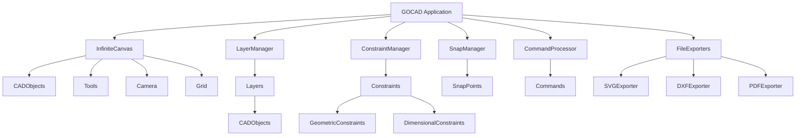
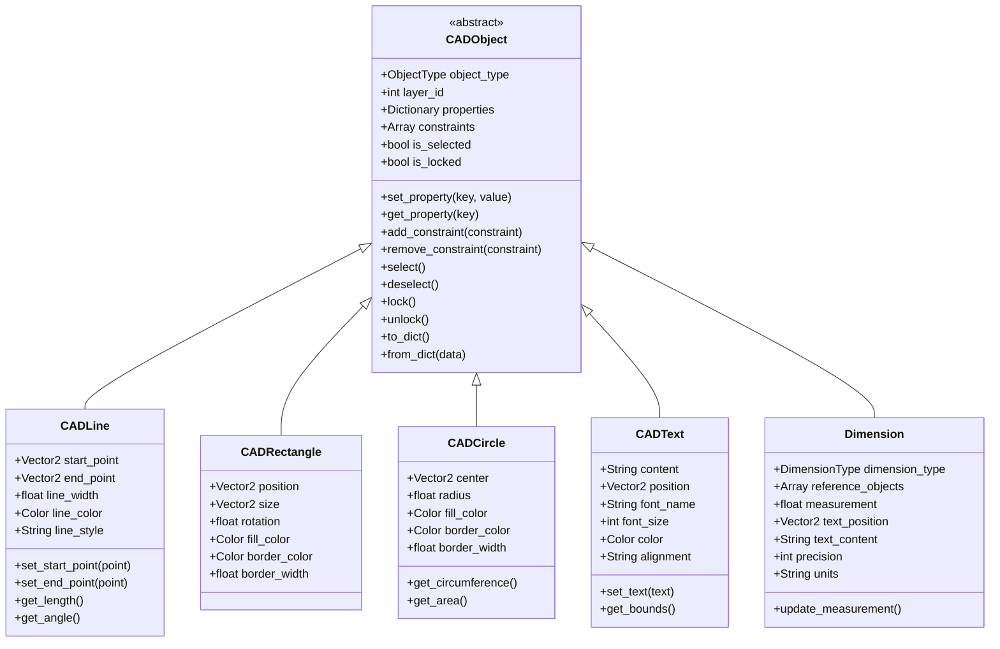
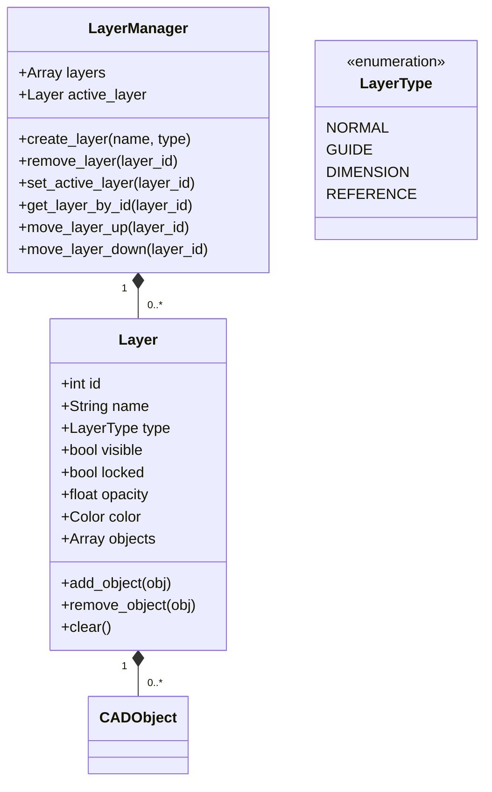
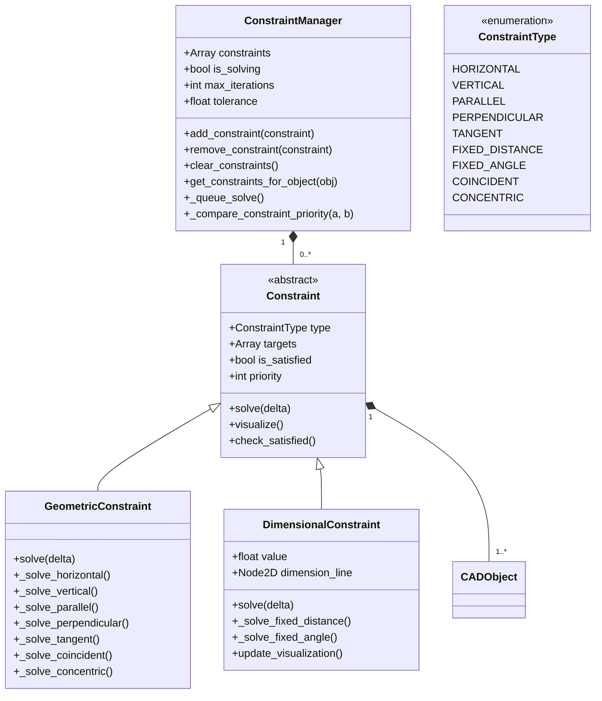
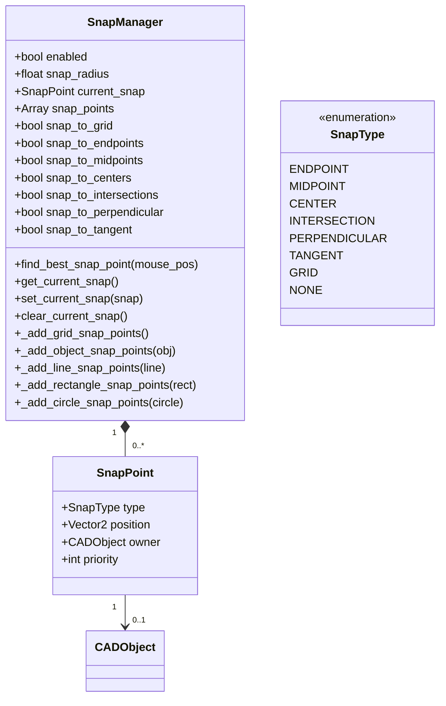
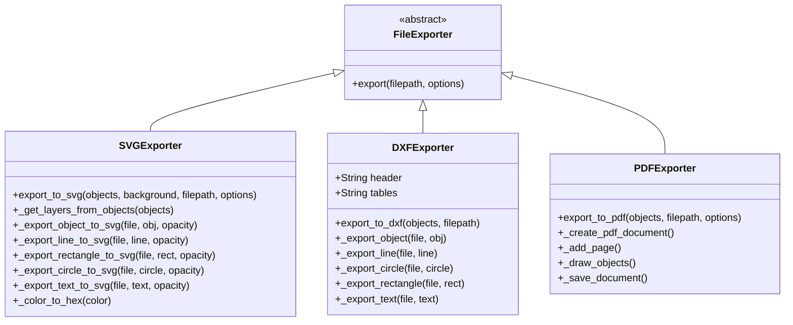
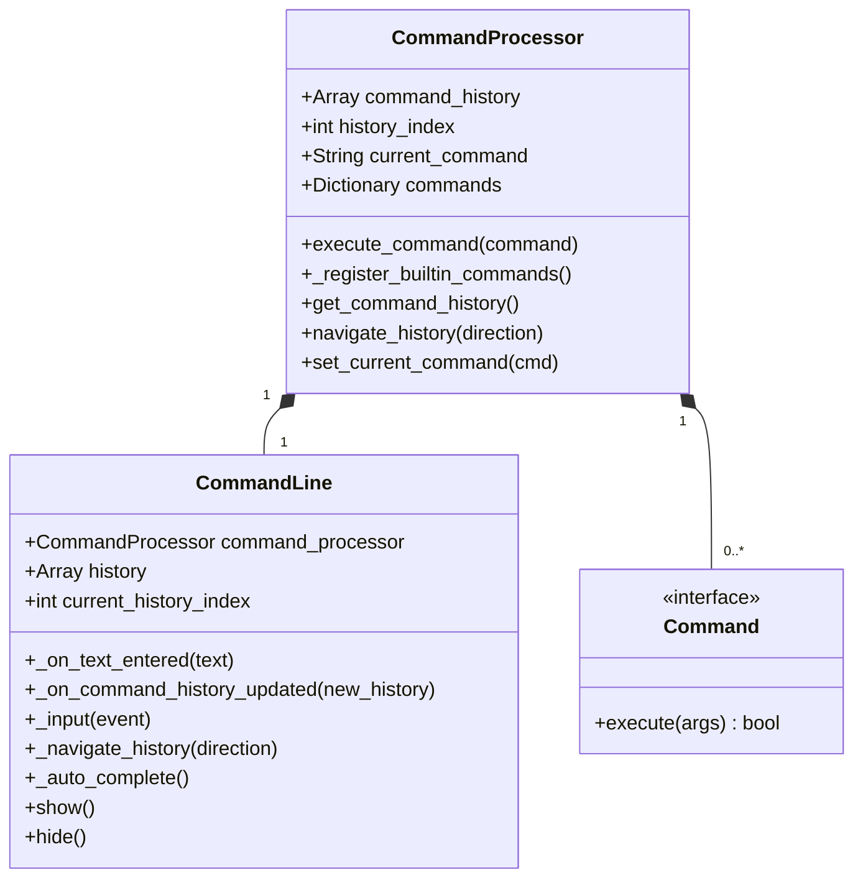
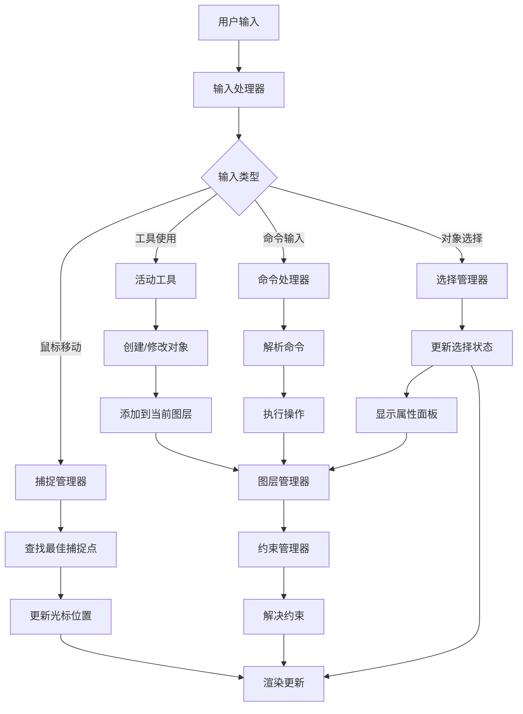
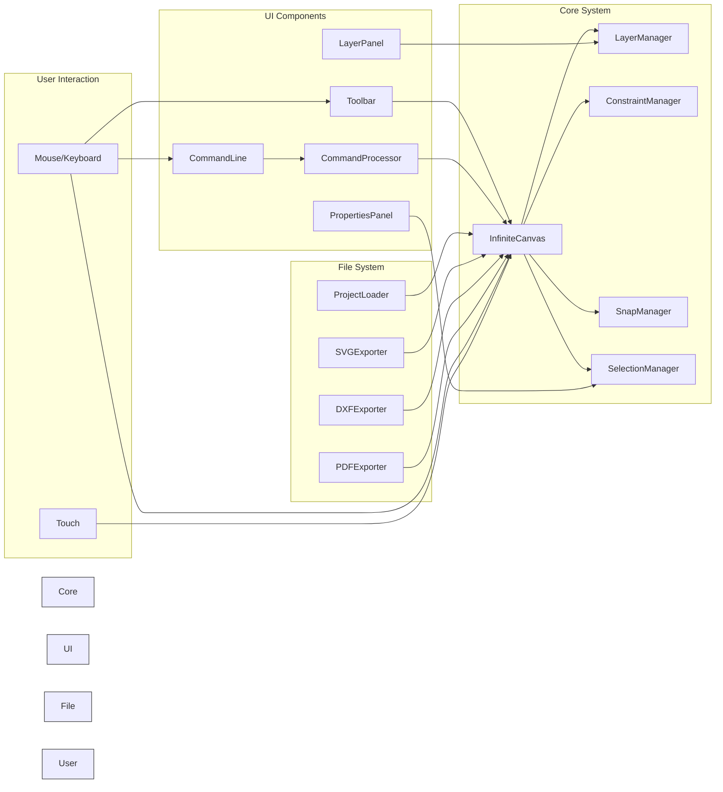
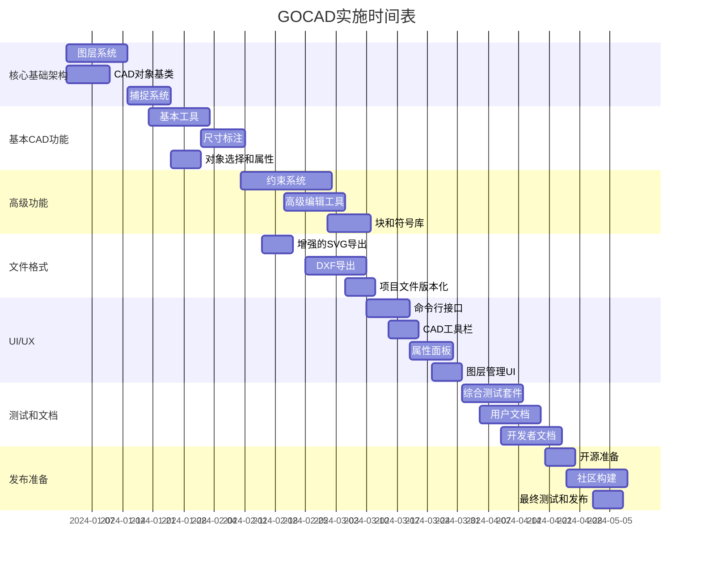

# GOCAD系统架构

## 组件图



## 类图 - 核心CAD对象



## 图层系统架构



## 约束系统架构



## 捕捉系统架构



## 文件导出架构



## 命令处理架构



## 数据流图 - 用户交互



## 系统集成概述



## 实施顺序



## 关键接口

### 图层管理器接口
```gdscript
# 所有组件与图层管理器交互的方式
interface LayerManagerInterface:
    func create_layer(name: String, type: int) -> Layer
    func remove_layer(layer_id: int) -> void
    func set_active_layer(layer_id: int) -> void
    func get_active_layer() -> Layer
    func get_layer_by_id(layer_id: int) -> Layer
    func get_all_layers() -> Array
    func move_layer_up(layer_id: int) -> void
    func move_layer_down(layer_id: int) -> void
```

### 约束管理器接口
```gdscript
interface ConstraintManagerInterface:
    func add_constraint(constraint: Constraint) -> void
    func remove_constraint(constraint: Constraint) -> void
    func clear_constraints() -> void
    func get_constraints_for_object(obj: Object) -> Array
    func solve_all_constraints() -> bool
    func set_max_iterations(iterations: int) -> void
    func set_tolerance(tolerance: float) -> void
```

### 捕捉管理器接口
```gdscript
interface SnapManagerInterface:
    func set_enabled(enabled: bool) -> void
    func set_snap_radius(radius: float) -> void
    func set_snap_to_grid(enabled: bool) -> void
    func set_snap_to_endpoints(enabled: bool) -> void
    func set_snap_to_midpoints(enabled: bool) -> void
    func set_snap_to_centers(enabled: bool) -> void
    func set_snap_to_intersections(enabled: bool) -> void
    func find_best_snap_point(mouse_pos: Vector2) -> SnapPoint
    func get_current_snap() -> SnapPoint
    func clear_current_snap() -> void
```

## 设计原则

1. **模块化**：每个组件都是自包含的，具有明确的职责
2. **可扩展性**：通过接口和基类设计以便于未来扩展
3. **性能**：优化大型项目的渲染和内存使用
4. **用户体验**：直观的界面和一致的行为
5. **兼容性**：保持对现有功能的支持
6. **文档**：每个组件都有清晰的文档和示例

## 关键技术决策

1. **约束求解**：迭代方法，具有可配置的最大迭代次数和容差
2. **图层渲染**：按图层顺序渲染，具有可配置的不透明度
3. **对象选择**：基于优先级的捕捉点系统
4. **文件格式**：逐步增强，保持向后兼容性
5. **命令处理**：基于文本的接口，具有历史记录和自动完成

这个架构文档提供了GOCAD系统的完整概述，展示了组件如何相互作用以及整体设计原则。它作为实施和未来扩展的蓝图。